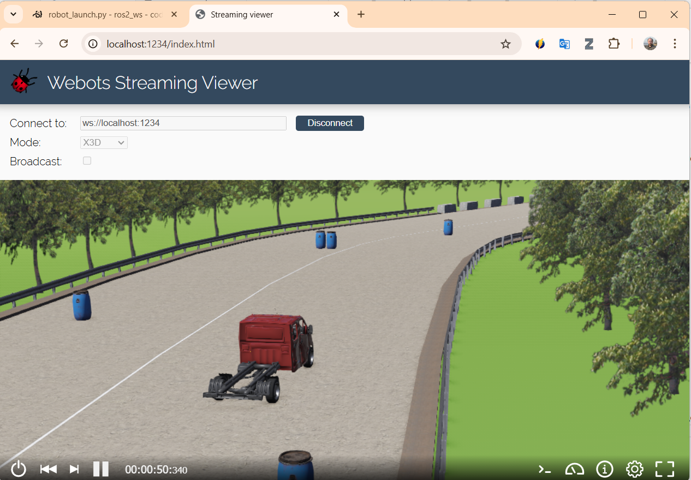
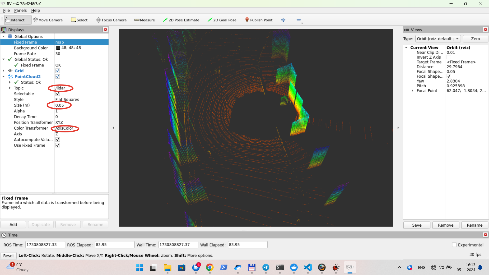

# Инструкция программиста по работе со виртуальным полигоном для разработки систем управления высокоавтоматизированных транспортных средств (ВАТС)

## Содержание

- [Инструкция программиста по работе со виртуальным полигоном для разработки систем управления высокоавтоматизированных транспортных средств (ВАТС)](#инструкция-программиста-по-работе-со-виртуальным-полигоном-для-разработки-систем-управления-высокоавтоматизированных-транспортных-средств-ватс)
  - [Содержание](#содержание)
  - [С чего начать?](#с-чего-начать)
  - [Запуск решения](#запуск-решения)
    - [Запуск Visual Studio](#запуск-visual-studio)
    - [Запуск решения в web-среде](#запуск-решения-в-web-среде)
    - [Запуск решения оконного приложения](#запуск-решения-оконного-приложения)
    - [Подготовка хостовой машины Windows](#подготовка-хостовой-машины-windows)
    - [Подготовка хостовой машины Linux](#подготовка-хостовой-машины-linux)
    - [Запуск решения](#запуск-решения-1)
  - [Структура проекта](#структура-проекта)
  - [Интеграция ROS2 и Webots](#интеграция-ros2-и-webots)
  - [Получение данных лидара](#получение-данных-лидара)
  - [Получение данных камеры](#получение-данных-камеры)
  - [Получение и трансляция координат ВАТС](#получение-и-трансляция-координат-ватс)
  - [Управление ВАТС: линейная и угловая скорости](#управление-ватс-линейная-и-угловая-скорости)
  - [Разработка собственного объекта Node](#разработка-собственного-объекта-node)
  - [Редактор карт](#редактор-карт)

---

## С чего начать?
Для разработки собственного контроллера вы можете воспользоваться заготовкой в файле `node_ego_controller.py`. Точкой входа в программу может быть метод обработки данных изображений, описанный ниже. Также можно использовать объект world_model для передачи данных между методами.

## Запуск решения

### Запуск Visual Studio

После того, как вы развернули Docker контейнер, необходимо запустить Visual Studio Code Server, в котором вы сможете редактировать исходные коды программ и запускать решение в симуляторе. ПОсле каждого запуска контейнера (после перезагрузки, например), необходимо на хостовой  машине (ваш основной компьютер) из рабочей папки проекта запустить команду в теминале:
Для Windows:
```bash
./run_windows.bat start-code-server
```

Для Linux:
```bash
make start-code-server
```
После запуска команды в любом браузере перейдите по ссылке [http://localhost:31415/?folder=/ulstu/ros2_ws](http://localhost:31415/?folder=/ulstu/ros2_ws), откроется окно редактора VS Code с исходными кодами программы


### Запуск решения в web-среде

Для того, чтобы в среде Visual Studio запустить терминал для запуска решения, необходимо открыть терминал .

В появившемся окне терминала необходимо выполнить команды для запуска:
1. Компиляцию проекта необходимо производить из папки `~/ros2_ws`. Если построение решения производить из другой папки, то все исполняемые файлы в папках `build` и `install` будут расположены в других директориях, и исполеямая среда ROS2 может их не распознать.

```bash
colcon build
```
Если в процессе работы над проектом вы столкнетесь с ситуацией, что вы изменили какие-то файлы, но поведение среды не изменилось, то попробуйте удалить папки `build` и `install` из директории `~/ros2_ws`. Иногда помогает.

2. Выполните команду `source` в папке `~/ros2_ws`, чтобы среда ROS2 узнала о всех ваших решениях и переменных среды. Эту команду необходимо выполнить после первой компиляции проекта, а также после того, как вы добавили новые файлы в проект. После изменения файлов и перекомпиляции проекта выполнять эту команду не обязательно:

```bash
source install/setup.bash
```

3. Запустите решение командой
```bash
ros2 launch webots_ros2_suv robot_launch.py
```
Это стандартная команда по запуску решения в ROS2. `webots_ros2_suv` - это наименование проекта, `robot_launch.py` - имя файла с логикой запуска, сам файл располагается в папке `projects/devel/webots_ros2_suv/launch`. В launch файле прописываются ноды, которые необходимо запустить для ROS2, их параметры, также прописываются команды для запуска симулятора Webots.
Первый запуск может занять какое-то время, пока Webots загрузить необходимые элементы сцены из интернета. В этот момент в терминале выводится сообщение `The Webots simulation world is not yet ready, pending until loading is done...`.

Если через 1 минуту в теминале вы не увидели сообщения, что сцена готова `Controller successfully connected to robot in Webots simulation`, то запустите решение еще раз, такое бывает.

4. В окне браузера перейдите по ссылке [http://localhost:1234/index.html](http://localhost:1234/index.html) и на открывшейся странице нажмите кнопку `Connect`, откроется окно с симуляцией .

Управление просмотром сцены:
- Скроллинг колеса мыши - изменение масштаба сцены
- Перемещение указателя мыши с зажатой левой кнопкой мыши - вращение сцены
- Перемещение указателя мыши с зажатой левой кнопкой мыши - перемещение точки обзора

5. Для остановки решения в терминале VS Code нажмите `Ctrl+C`.

### Запуск решения оконного приложения

Решение можно запускать также в режиме, позволяющем открывать полноценное оконное приложение Webots со всеми его возможностями. Этот режим также позволяет запускать стандартные средства ROS2 (rviz  др), а также любые другие оконные приложения, установленные внутри docker-контейнера.

### Подготовка хостовой машины Windows

Для того, чтобы на вашей хостовой машине Windows отображались окна приложений, запущенных внутри docker контейнера, поставьте приложение XLaunch, входящее в состав утилит [VcXsrv](https://sourceforge.net/projects/vcxsrv/) и запустите его. При запуске все настройки оставьте по умолчанию, в предпоследнем диалоговом окне выберите галочку `Disable access control`. После нажатия кнопки `Готово` на последнем диалоговом окне окно настройки пропадет, а в панели уведомлений должен появиться новый значок запущенного приложения XLaunch.

### Подготовка хостовой машины Linux

На хостовой Linux машине выполните в терминале команду 'xhost +'.

### Запуск решения


Чтобы работало перенаправление окон из docker-контейнера в хостовую машину, необходимо закомментировать параметр `export WEBOTS_OFFSCREEN=1` в файле `~/.bashrc`, поаставив первым символом `#`. Это можно сделать встроенным редактором `nano`:
```bash
nano ~/.bashrc
```
Должно получиться так: 
```bash
# export WEBOTS_OFFSCREEN=1
```

После этого примените изменения командой
```bash
source ~/.bashrc
```

Еще лучше перезагрузить контейнер в терминале хостовой машины
```bash
docker restart ulstu-devel
```

Запуск решения можно производить из Web среды Visual Studio Code, как это было описано ранее, или непосредственно из терминала Linux. Для подключения к терминалу docker-контейнера, выполните команду в терминале хостовой машины:
```bash
docker exec -it ulstu-devel bash
```


## Структура проекта

Все файлы проекта, которые необходимо изменять для подготовки системы управления ВАТС располагаются в папке `projects/devel`. Эта папка автоматически монтируется в docker-контейнер, внутри которого создается символическая ссылка в `~/ros2_ws/src`на директории `webots_ros2_suv` и `robot_interfaces`:
- `robot_interfaces` - содержит необходимые файлы для определения собственных сообщений ROS2. Если вам понядобятся собственные сообщения для передачи между объектами Nodes, то их следует добавлять в эту директорию по [инструкции](https://docs.ros.org/en/humble/Concepts/Basic/About-Interfaces.html).
- `webots_ros2_suv` - основная директория проекта
  - `config` - конфигурационные файлы проекта. Вам может понадобиться только файл `simulator/map_config.yaml` для указания соответствия начальных глобальных координат ВАТС в точке старта, т.к. симулятор предоставляет только координаты в метрах относительно точки старта. Файл `global_maps/robocross.geojson` содержит координаты маршрута следования, сформированные во встроенном редакторе карт. Его использование илил модификация остается на усмотрение участников соревнований. Другие конфигурационные файлы предназначены "для ознакомления". 
  - `controllers` - контроллеры встроенных объектов Webots, не требуют редактирования.
  - `launch/robot_launch.py` - python файл с параметрами запуска, в котором прописываются все объекты типа Nodes, которые необходимо использовать при запуске проекта.
  - `map-server` - исходные коды редактора карт. Если есть необходимость внесения изменений, то для компиляции необходимо установть Node, и выполнить команды  `npm install & npm run build`. В базовом варианте использования этого не требуется.
  - `protos` - модели объектов сцены Webots
  - `resource` - вспомогательные служебные файлы. Если у вас будут свои, их следует добавлять в эту папку.
  - `worlds` - файлы со сценами Webots
  - `webots_ros2_suv` - файлы с управляющими программами. Основная рабочая директория проекта:
    - `lib` - директория с утилитами, классами
    - `node_sensor_webots.py` - объект типа Node, формирующий основные сообщения в системе ROS2, а также осуществляющий необходимые служебгные преобразования данных.
    - `node_ego_controller.py` - основной контороллер робота, объект типа Node, точка входа для начала программирования собственного контроллера


Системные файлы и каталоги, которые имеет смысл редактировать, только если понимаете, что делаете и зачем:
- `config` - директория с конфигурационными файлами для настройки docker-контейнера. Включают в себя конфигурацию среды bash, vscode server, webots. 
- `docs` - документация по настройке и программированию системы управления
- `.gitattributes` и `.gitignore` - настройка параметров среды git
- `Dockerfile.base` - файл, описывающий порядок сборки образа docker
- `Makefile` - скрипты развертывания docker-контейнера в Linux
- `start.sh` - скрипт для Linux, который запускает процесс развертывания
- `README.md` - инструкция по развертыванию
- `run_windows_first.bat` -  исполняемый файл для Windows, который развертывает окружение (включая построение образа docker, запуск контейнера, настройку окружения)
- `rin_windows.bat` - основной файл развертывания окружения в ОС Windows.

## Интеграция ROS2 и Webots

ROS2 и Webots работают в связке для симуляции поведения робота на виртуальном полигоне. 

Для того, чтобы ROS2 мог получать данные от сенсоров робота и отправлять команды на движение в Webots, реализован контроллер `webots_ros2_suv/suv_driver.py`, который прописан в файле `webots_ros2_suv/resource/suv.urdf`, являющийся одним из параметров запуска Webots в файле `webots_ros2_suv/launch/robot_launch.py`. 

В базовом сценарии работы с полигоном эти файлы можно не изменять.
 
## Получение данных лидара

Пример получения данных с лидара реализован в ноде `webots_ros2_suv/node_ego_controller.py`.
Для получения данных от драйвера `webots-ros2` в конструкторе класса определен подписчик топика `/lidar`, в качестве параметров которого указан метод класса `__on_point_cloud`.
```python
self.create_subscription(PointCloud2, '/lidar', self.__on_point_cloud, qos)
```
Это значит, что при получении данных от лидара автоматически будет вызван метод `__on_point_cloud`, в качестве параметров этого метода указана переменная data типа `PointCloud2`, которая и будет содержать массив данных лидара. Свой код по обработке данных лидара необходимо вызывать именно из этого метода.

Для отладки получения сообщений от лидара можно в терминале docker-контейнера вызвать команду `ros2 topic hz /lidar`, которая выведет текущую частоту получения данных от лидара.

Также, если вы работаете в режиме запуска оконного приложения, то можно воспользоваться утилитой `rviz2` для визуализации данных лидара. Для этого выполните в терминале docker-контейнера команду `rviz2 rviz2`, в появившемся окне Добавьте объект с типом `PointCloud2` и установите настройки как на рисунке ниже


Визуализацию данных лидара также можно произвести непосредственно в оконной версии Webots, выбрав пункт меню `View->Optional Rendering->Show Lidar PointCLoud`


## Получение данных камеры

Пример получения данных с камеры реализован в ноде `webots_ros2_suv/node_ego_controller.py`.
Для получения данных от драйвера `webots-ros2` в конструкторе класса определен подписчик топика `/vehicle/camera/image_color`, в качестве параметров которого указан метод класса `__on_image_message`.
```python
self.create_subscription(sensor_msgs.msg.Image, '/vehicle/camera/image_color', self.__on_image_message, qos)
```
Это значит, что при получении данных от камеры автоматически будет вызван метод `__on_image_message`, в качестве параметров этого метода указана переменная data типа `Image`. Свой код по обработке данных камеры необходимо вызывать именно из этого метода. В этом же методе реализован код по преобразованию переменной типа sensor_msgs.msg.Image
 в тип PIL Image, а также numpy массив, который может быть использован в opencv или других библиотеках по обработке изображений, в т.ч. библиотеках глубокого обучения tensorflow или pytorch, которые уже устввновлены в docker-контейнере.

Для отладки получения сообщений от камеры можно в терминале docker-контейнера вызвать команду `ros2 topic hz /vehicle/camera/image_color`, которая выведет текущую частоту получения данных от лидара.


## Получение и трансляция координат ВАТС

Пример получения глобальных координат реализован в ноде `webots_ros2_suv/node_ego_controller.py`.
Для получения данных в конструкторе класса определен подписчик топика `/odom`, в качестве параметров которого указан метод класса `__on_gps_message`.
```python
self.create_subscription(Odometry, '/odom', self.__on_odom_message, qos)
```
Это значит, что при получении данных координатах автоматически будет вызван метод `__on_odom_message`, в качестве параметров этого метода указана переменная data типа `[Odometry](https://docs.ros2.org/foxy/api/nav_msgs/msg/Odometry.html)`. Свой код по обработке данных о координатах необходимо вызывать именно из этого метода. 

В этом методе описан пример преобразования относительных коодинат (относительно точки старта) в глобальные координаты. Соответствие точки старта (0, 0) глобальным координатам указывается в конфигурационном файле `webots_ros2_suv/config/simulator/map_config.yaml`. Эти параметры можно не изменять.


## Управление ВАТС: линейная и угловая скорости

Для того, чтобы робот начал движение, необходимо сформировать сообщение типа `AckermannDrive`  и отправить его в топик `cmd_ackermann`. Пример:
```python
self.__world_model.command_message.speed = 5.0
self.__world_model.command_message.steering_angle = 0.0
self.__ackermann_publisher.publish(self.__world_model.command_message)
```
Пример такого кода реализован в методе `drive` в файле `webots_ros2_suv/node_ego_controller.py`.
Метод drive вызывается после обработки каждого кадра изображения от камеры в методе `__on_image_message`. Логика вызова метода может быть любой.


## Разработка собственного объекта Node
В среде ROS2 управляющие программы для ВАТС организованы в виде объектов типа Node, представляющий собой в процессе запуска решения отдельные процессы, которые осуществляют [передачу сообщений](https://design.ros2.org/articles/intraprocess_communications.html) между собой посредством модели Publisher/Subscriber или RPC.

Для создания собственного объекта Node необходимо:
1. Добавить файл python в папку `webots_ros2_suv/webots_ros2_suv`, например `mynode_controller.py`.
2. Добавить класс, наследуемый от класса Node:
```python
class MyNode(Node):
    def __init__(self):
        try:
            super().__init__('mynode_controller')

        except  Exception as err:
            self._logger.error(''.join(traceback.TracebackException.from_exception(err).format()))

```
3. В этом файле определить точку входа, метод main:
```python
def main(args=None):
    try:
        rclpy.init(args=args)
        mynode_controller = MyNodeController()
        rclpy.spin(mynode_controller)
       rclpy.shutdown()
    except KeyboardInterrupt:
        print('server stopped cleanly')
    except  Exception as err:
        print(''.join(traceback.TracebackException.from_exception(err).format()))
    finally:
        rclpy.shutdown()
```

4. В файле `webots_ros2_suv/setup.py` изменить переменную `entry_points`, добавив описание нового класса MyNode по образцу:
```python
    entry_points={
        'console_scripts': [
            'node_sensors_webots = webots_ros2_suv.node_sensors_webots:main',
            'node_ego_controller = webots_ros2_suv.node_ego_controller:main',
            'mynode_controller = webots_ros2_suv.mynode_controller:main',
        ],
        'launch.frontend.launch_extension': ['launch_ros = launch_ros']
    }
```
5. Перекомпилируйте проект и обновите переменные окружения 
```bash
colcon build
source install/setup.bash
```


## Редактор карт

Редактор карт позволяет отобразить текущее положение робота на глобальной карте. для этого после запуска решения необходимо в браузере открыть ссылку [http://localhost:8008](http://localhost:8008).

Редактор предоставляет возможности для создания карты проезда, доступной в программном коде. Элементы редактирования определяются в конфигурационном файле `webots_ros2_suv/config/ego_states/robocross.yaml` в YAML формате.

Пример проверки нахождения робота внутри полигональной зоны, созданной в карте (файл `webots_ros2_suv/webots_ros2_suv/lib/world_model.py`):
```python
  def get_current_zones(self):
      lat, lon, o = self.get_current_position()
      zones = []
      for p in self.global_map:
          if p['type'] == 'Polygon':
              if is_point_in_polygon(lat, lon, p['coordinates'][0]): # and self.cur_path_point > 2:
                  zones.append(p)
      return zones
```

Редактор карт также осуществляет вывод изображения с камеры робота.
